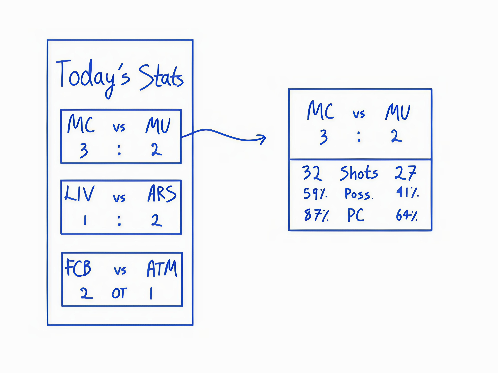

# Fotbalové statistiky

Autor: Ali Y. ali.yunussov.s@gyarab.cz

## Odborný článek

Tento projekt zahrnuje databáze fotbalových týmů, hráčů a zápasů. Každý tým má název, logo, domácí stadion a seznam hráčů. Zápasy zahrnují datum, soupeře, výsledek, místo konání a seznam klíčových událostí.

Na homepage se nachází přehled zápasů, který lze filtrovat (podle týmů) a řadit (dle data nebo skóre). Přehled tvoří kartičky, na kterých se zobrazuje datum, týmy a výsledek.

Hlavní menu obsahuje odkaz na homepage (přehled zápasů), seznam týmů a seznam hráčů.

## Wireframe

